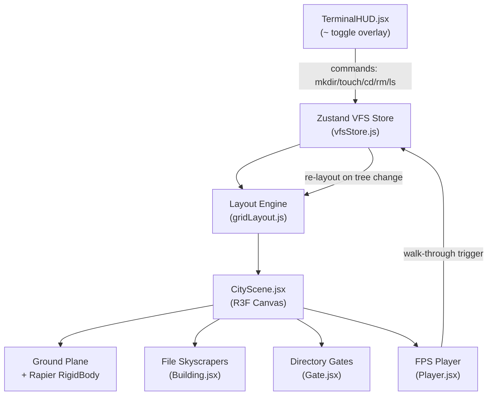

# Silicon City — Implementation Plan

## Architecture Overview



## New Files to Create

- `src/store/vfsStore.js` — Zustand store (VFS tree + CWD pointer + actions)
- `src/engine/gridLayout.js` — grid-packing algorithm (no overlap, returns `{x,z}` per node)
- `src/components/CityScene.jsx` — top-level R3F `<Canvas>` scene
- `src/components/Building.jsx` — file skyscraper mesh (height, color by extension)
- `src/components/Gate.jsx` — hollow directory archway with walk-through detector
- `src/components/Ground.jsx` — flat city ground plane with Rapier collider
- `src/components/Player.jsx` — WASD + mouse FPS controller with Rapier capsule
- `src/components/TerminalHUD.jsx` — `~`-toggled command input overlay
- `src/components/HolographicLabel.jsx` — billboard label pulsing above structures

## Existing Files Changed

- [`src/App.jsx`](src/App.jsx) — replace boilerplate with `<CityScene>` + `<TerminalHUD>`
- [`src/App.css`](src/App.css) / [`src/index.css`](src/index.css) — reset to dark fullscreen, HUD styles
- [`package.json`](package.json) — add new dependencies

## Dependencies to Install

```
@react-three/fiber @react-three/drei @react-three/rapier
three zustand gsap
```

---

## Phase 1 — Virtual Kernel (Zustand VFS Store)

**File:** `src/store/vfsStore.js`

> The VFS is entirely in-memory. No real filesystem is read. The city always boots from an empty root.

Initial state:
```js
{
  tree: { name: '/', type: 'dir', children: [] },  // always starts empty
  cwd: '/',          // absolute path string
  cwdNode: <ref>,    // live reference into tree
}
```

Actions: `mkdir(name)`, `touch(name, sizeBytes)`, `cd(path)`, `rm(name)`, `ls()` — all mutate the in-memory JSON tree via Immer-style produce inside Zustand. `touch` accepts an optional `sizeBytes` argument (defaults to a random plausible value) so the user doesn't need to know the exact byte count — the HUD can accept `touch readme.txt` and auto-assign a size.

---

## Phase 2 — Layout Engine + 3D Scene

**File:** `src/engine/gridLayout.js`

Grid-packing: assign each child node a cell on a square grid (spiral outward from center). Returns `{ id, x, z }` positions — buildings never overlap.

**`Building.jsx`** — Box mesh, height from `Math.log10(size) * SCALE_FACTOR`. Color/style by extension:
- `.js` → Cyan Neon emissive material
- `.mp4` → wide flat monolith
- `.txt` → slender white tower
- default → grey block

**`Gate.jsx`** — Torus/arch mesh marking each directory. `onCollisionEnter` from Rapier triggers `cd()`.

---

## Phase 3 — Physics & Player

**`Ground.jsx`** — `<RigidBody type="fixed">` flat plane.

**`Player.jsx`** — Rapier capsule rigid body, locks rotation. Keyboard state via `useKeyboardControls` (drei). Mouse pointer-lock for camera look. Space = vertical impulse for jump.

Walk-through gate detection: each `Gate` has a Rapier sensor collider; collision with player capsule fires `vfsStore.cd()`, triggering a non-Euclidean scale transition (GSAP tween on camera FOV + world scale).

---

## Phase 4 — Animation & Polish

**`mkdir` Construction Event:** When a new directory node appears in the store, spawn 3 drone meshes (small boxes) that fly from sky → building footprint → extrude the walls over ~1.5 s using GSAP.

**`rm` De-res Effect:** Dissolve shader on the building (custom GLSL or opacity tween from 1→0 with scale collapse).

**`ls` Holographic Labels:** `HolographicLabel.jsx` uses `<Html>` from drei as a billboard; pulses opacity 0.4↔1 on a sine loop when `ls` is called.

**`cd` Scale Transition:** On directory entry, GSAP tweens the current city group scale from 1→0.05 while the child city group tweens 0.05→1 over ~800 ms.

---

## File Extension Color Map

- `.js / .jsx / .ts / .tsx` → Cyan (`#00ffff`)
- `.mp4 / .mov / .avi` → Purple wide monolith (`#8800ff`)
- `.txt / .md` → White slender (`#ffffff`)
- `.py` → Yellow (`#ffee00`)
- `.json` → Orange (`#ff8800`)
- default → Steel grey (`#888888`)
